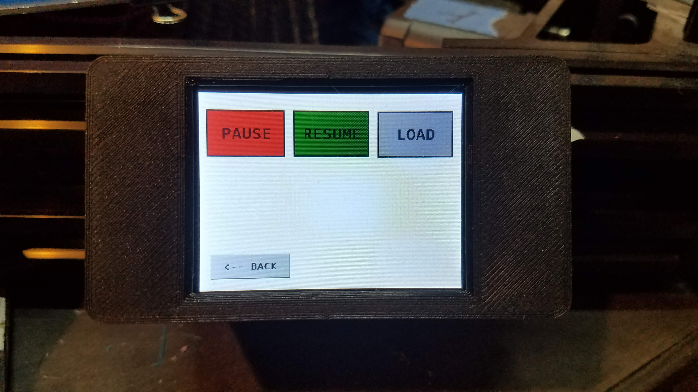

Hey thanks for looking at my project!

# Overview

This project is a strange one but works for me.  
I have a 3D printer that uses the [Duet Wifi](https://duet3d.com/DuetWifi?manufacturer_id=11) control board, which is a great board for controlling 3D printers.
I use the web interface to upload gcode files and monitor progress, and don't *really* need a display at the printer 
(duet does make the [PanelDue](https://duet3d.com/PanelDue) which is overkill for my needs but seems pretty thorough)

But there are a couple of tasks to do at the printer that required me to take out my phone, 
and also occasionally in a long print the wifi would be lost and I would be unable to pause the print to change filament colors.

So this project came about.  It allows you to make a display that costs less than the PanelDue with three screens:
  * Printing status
  
  
  
  * Pre-heat bed and extruder
  
  
  
  * Pause print and load new filament
  
  

You of course could implement more functions, these were what I wanted.  

So, if: you are rich enough to spring for the Duet Wifi *and* you're too cheap to buy the PanelDue *and* you are handy with arduinos, this is your project!

# Duet Data

 ## Status
The data from the duet wifi comes from a serial port.  There is a serial port for the PanelDue, and it uses gcode to communicate.
All the data for my display comes with a single command.  `M408` causes the Duet to send a string with many status states. 

Try it at the web interface to see what happens!

This is the output of `M408` while my printer was running (it is JSON format):

```
{"status":"P",
"heaters":[75.0,194.8,22.7],
"active":[75.0,195.0,0.0],
"standby":[0.0,0.0,0.0],
"hstat":[2,2,0],
"pos":[-35.248,-15.877,54.700],
"sfactor":100.00,
"efactor":[100.00,100.00],
"babystep":0.000,
"tool":0,
"probe":"0",
"fanPercent":[50.00,100.00,100.00,0.00,0.00,0.00,0.00,0.00,0.00],
"fanRPM":0,"homed":[1,1,1],
"fraction_printed":0.7257,
"msgBox.mode":-1,
"timesLeft":[7527.1,7728.8,7837.4]}
```
Important info from this:
  * Temperatures from "heaters" (my printer has 3 probes: bed, hot end, enclosure)
  * Temperature setpoints
  * Percent done (0.7257 = 72.5%)
  * Various estimates of time left (seconds)
  
  ## Other gcode I used ([see the list](https://reprap.org/wiki/G-code)):
  * `G28` Homes the machine
  * `M140` adjusts the bed temperature
  * `M104` adjusts the hot end temperature
  * `M25` Pauses the print
  * `M24` Un-pauses the print
  * `G1 E50 F60`  Feeds 50mm at 50 mm/min to load filament
  
So lets hook an arduino up to get the data and command the commands!

# Arduino stuff
The arduino is the middle-machine between the Duet and the screen.  It needs a serial port to talk to the Duet as well as a serial port to talk to the Nextion display.  I used an Adafruit Feather M0 data logger board for this project as I had one handy.  The M0 processor is very powerful (compared to an arduino Uno) and has the ability to create extra serial ports.  You can find the arduino code in this archive, I started with an example of how to configure another serial port and hacked away from there.  The data from the Duet is JSON formatted and the JSON library parses this nicely.  The Nextion display has many examples to copy.

You need to turn off checksums for the PanelDue serial port on the Duet board because the arduino does not calculate checksums.  The command `M575 P1 S0` added initialization script will make this work.  If you ignore this the arduino will not communicate with the Duet!

# Display
I used a Nextion display.  This is a powerful but complex module, you can create very impressive GUI displays using the Nextion software on your PC, then program the display so it is easy to interface with a microncontroller.  Since the display is pre-configured, the microcontroller only has to deal with a small amount of data rather than constructing a display from scratch.  If you are new to these devices I recommend [Andreas Spiess's video #056](https://youtu.be/D-zgtylBKUc).

Using the editor I created the 3 pages I wanted with buttons and displays.  Then I wrote arduino code based on the built-in examples to communicate with the display.

 # Shut Up I Just Want to Make One
 If this shows up on AliExpress I will be honored and offended!
 
  ## 1.  Program the Arduino
  Put the arduino code into the Feather M0 board.  I used the [Feather M0 Adalogger](https://www.adafruit.com/product/2796) because I had one.  I think that most of the M0 boards would work.
  
  ## 2.  Program the Nextion
  Put the nextion code into the Nextion display.  I used the small 2.4 inch board.
  
  ## 3. Wire it up
  
  Duet has a panelDue port with 5V, Gnd, Tx and Rx.
  The 5V and Gnd go to both the arduino and Nextion.
  
  The Feather M0 is set up to use the regular serial port at Rx0 and Tx0.
  The new serial port (SERCOM) is at TX=D10 and RX=D11 as in the [example](https://learn.adafruit.com/using-atsamd21-sercom-to-add-more-spi-i2c-serial-ports/creating-a-new-serial).
  
  Connect 
   * Duet Tx to Feather Rx0
   * Duet Rx to Feather Tx0
   * Nextion Tx to Feather D11
   * Nextion Rx to Feather D10
   * Power and Ground from Duet to Feather and Nextion
  
  ## 4. Print a case
  
  I used [this one](https://www.adafruit.com/product/2796).
 
 ## Have fun with your printer!
